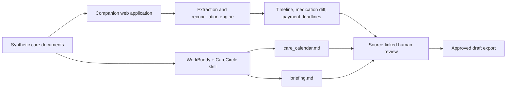

# Architecture

## System boundary

CareCircle uses a hybrid design. WorkBuddy demonstrates autonomous planning and document operations; the web application provides a polished, deterministic review and evidence surface.

## Why both components exist

### WorkBuddy

- Selects and reads files in an authorized workspace.
- Plans the multi-step reconciliation task.
- Applies the installed CareCircle domain skill.
- Writes ready-to-review Markdown artifacts.

### Companion application

- Makes the outcome understandable in seconds during judging.
- Demonstrates the same reconciliation behavior deterministically.
- Provides exact source evidence and human-review controls.
- Gives the team a deployable web link and GitHub software artifact.
- Does not require a WorkBuddy API or expose private credentials.

## Data flow

1. The user chooses an isolated folder containing documents for one senior.
2. Patient names are compared before reconciliation; mixed names produce an important stop flag.
3. Appointments are matched by reference number and then by context.
4. Medication snapshots are ordered by their stated list date.
5. Dated bills and deadlines enter the unified timeline.
6. Every reconciled fact retains source-document references.
7. Important findings must be reviewed before the web plan can be approved.

## Browser support

The companion app accepts:

- text;
- Markdown;
- CSV and JSON as readable text;
- PDFs with embedded text layers.

Image OCR and image-only PDF extraction are intentionally handed off to WorkBuddy or another approved OCR flow. Extracted OCR text must be manually checked. The browser app does not pretend that a text-generated PDF proves OCR capability.

## No backend requirement

The hackathon demo is intentionally static. This provides:

- no database or secrets to configure;
- deployment on Vercel, Netlify, GitHub Pages, or Tencent EdgeOne;
- reproducible results during judging;
- less risk of accidentally retaining synthetic or future user data.

A production pilot would add authenticated storage, consent records, audited access, approved OCR, and a formal healthcare/privacy review.

